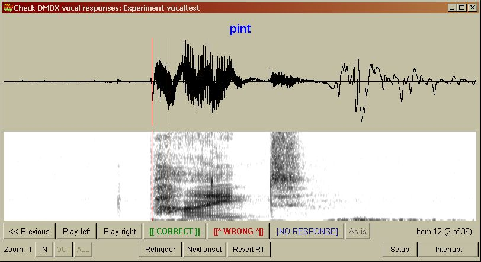

# CheckVocal

**CheckVocal** is a program to help process the results of naming tasks in [DMDX](http://www.u.arizona.edu/~kforster/dmdx/dmdx.htm), which need to be checked for accuracy (correct/wrong response) and timing (properly triggered voice key).  
**azk2txt** is distributed along with CheckVocal, for those who simply need to convert azk output from DMDX into a structured text file to be read by a spreadsheet or statistical processing program.  
**CheckFiles** is also distributed along with CheckVocal, for those who need to mark RTs (sound onset or offset) on arbitrary sets of files (not produced by DMDX). Simply copy all your .wav files into a folder and select this folder for processing.

_**DISCLAIMER/WARNING:** CheckVocal, CheckFiles, and azk2txt are not guaranteed to work right or to be appropriate for you or for your data. I have tried to make them useful and robust for my personal use, and I have found them so useful for my work that I think other people might like to use them. Download and use them at your own responsibility and risk. You are advised against relying exclusively on these programs for critical data. In any case, you should always confirm, by examining the output file against the original azk data file, that the stored values are correct. You may not blame me if you lose your data, your results make no sense, or your computer explodes. On the other hand, if you identify any errors or problems I'd be grateful if you'd [let me know](mailto:protopap@gmail.com) so I can try and fix them for future releases of CheckVocal/CheckFiles/azk2txt._

[Download CheckVocal/CheckFiles](https://github.com/0avasns/CheckVocal/releases/download/v3.0.0/CheckVocal_3.0.0.7z) v3.0.0a (31 May 2019) – Includes azk2txt v1.2.3  
Uncompress this file with [7-zip](https://www.7-zip.org/) to a location of your choice. CheckVocal.exe, azk2txt.exe, and CheckFiles.exe will be found in the newly created “CheckVocal” folder.   
As 3.0 is not thoroughly tested yet, you may want to use a [previous stable version](https://github.com/0avasns/CheckVocal/releases/download/v.2.3.1.0/CheckVocal_archive.exe) instead.  
If you have [Python](http://www.python.org/) and [Snack](http://www.speech.kth.se/snack/) installed, then you can download the script files only: CheckVocal.pyw and azk2txt.pyw can be found as Source Code under the corresponding releases on [github](https://github.com/0avasns/CheckVocal/releases). Note that Snack only works with 32-bit Python version 2; if you have Python 3 or a 64-bit installation then you won't be able to use it.  

**New in version 3.0.0:**  Selection of processing modes (bottom row in setup window), including:   
-- Correct/Wrong with RT (default; the standard and only available CheckVocal behavior up to now)   
-- Classification into 2-6 classes with RT (useful, for example, for stress assignment or other multinomial judgments)   
-- Free user field, no RT (an integer number is typed by the user; useful for registering vocal reports or error counts)  

---

### Prerequisites

To use CheckVocal you will need to have all of the following in the same folder, before you double-click on `CheckVocal.exe`:
1.  Your .azk results file (e.g., `naming.azk`).
2.  Your .rtf item files (e.g., `naming.rtf`), unless you specify the timeout value on the CheckVocal setup window.
3.  All .wav files with the recorded responses for the participants whose data you want to process (e.g., `namingSID101.wav`, `namingSID102.wav`, etc.).
4.  An -ans.txt file with the correct responses to your experimental items, numbered to match the item file (e.g., `naming-ans.txt`). More about this file below.

##### In order to use CheckVocal you must first:
*   Set up your experiment item file such that all items are individually numbered (no practice trials with the same item number).
*   Always use a subject ID when running DMDX; the ID must be different for each participant and may not contain commas.

_(Thanks to Boris New for suggesting and helping set up this section.)_

----

## Program information and use instructions

CheckVocal will display each naming waveform and spectrogram along with the timing mark from the .azk file and the correct response string (from a specially prepared “answer” file). The user may, optionally, click on the waveform or spectrogram to place the timing mark elsewhere (e.g., if it has been mistriggered by lip smacking or other event; or late-triggered by an unusually low-volume onset of the response). The software can also automatically re-trigger to calculate the RT on the basis of an adjustable threshold, or move on to a subsequent onset.

For each displayed waveform the user must indicate, with a single mouse click, if the response is “correct,” “wrong,” or if there is “no response” – the displayed correct response helps decide quickly. The next response is then automatically loaded and immediately displayed. This means that if the VOX (either from DMDX or from CheckVocal) is properly adjusted (or if you are not interested in the response times) then going through the responses will be extremely fast, with a single click per trial.

Every time a response waveform is displayed or a timing change is made, the sound is played out automatically from the timing mark on (not from the beginning!), in order to ensure that the selected interval contains the entire response. To further verify timing, if desired, one may click to hear the sound up to the timing mark (play left), or from the timing mark on (play right).

Because CheckVocal simplifies the process a lot, it is easy to make a mistake by rushing. The option to return to the previous response allows to correct mistakes.

CheckVocal shows a progress indicator and the total number of responses to be examined. The process can be interrupted at any time and then resumed automatically (optionally) at any later time, simply by re-running CheckVocal and selecting the same .azk file for processing. The program saves its status completely at every response (and flushes file buffers), so it is safe even in the case of power or OS failures or other interruptions. When started, if an unfinished session is detected, CheckVocal gives the option to continue or start anew.

CheckVocal reads the correct vocal responses from a text file named like the item file plus “-ans”. For example, for experiment Exper1.rtf, the answers should be in Exper1-ans.txt and this -ans file should reside in the same folder as the .rtf and .azk files. This text file should contain one line per trial (item), and each line should contain the item number (matching the experiment file!) and the correct response as a character string (word). For example, if you have the following two items in Exper1.rtf:  
```
+100 * "dog" / ;  
+200 * "cat" / ;  
```
and if “yes” and “no” are in fact the correct vocal responses to these displayed word stimuli, then Exper1-ans.txt must contain these lines:  
```
100 yes  
200 no  
```
(As of version 2.3.0, answer files are also possible with CheckFiles: Create a text file named CheckFiles-ans.txt in the same folder as your wav files, and in each line of this file list one filename and the associated correct answer, separated by space. Filenames need not be complete but must uniquely identify wav files in the folder.)

If there are any trials without vocal responses (and, therefore, no corresponding sound files) set the corresponding response string in the ans file to `*!*` (asterisk, exclamation, asterisk, without spaces between them). This will direct CheckVocal to ignore these trials and simply reproduce the existing RT from the azk in its output.

If you allow items to be repeated, CheckVocal can be instructed to ignore all but the last repetition (which will be the only one with a recorded vocal response, since previous ones with the same item number will have been overwritten). This will only work on _consecutive_ trials with _identical_ item numbers.

CheckVocal lets you select a subset of the subjects for which .azk responses are available. It will automatically deselect subjects with missing response lines or missing audio files (e.g., recording failures or deleted wavs). This selection is carried over automatically when continuing an interrupted process.

The output of CheckVocal is saved in a plain text file named as the experiment (item) file plus “-datalist”. By default this is a tab-separated file of RTs, one line per subject, including a first row of column headings (with the item numbers). In the starting setup panel, you may select space-separated or comma-separated instead of tab-seperated, and subject columns instead of subject rows. In DMDX fashion, incorrect responses are indicated with negative RT values, and no-response trials are indicated with negative timeout values. This output file from CheckVocal is trivial to load directly into Excel or SPSS or other statistical program for further processing. Alternatively, you may save the output in .azk format, if you need to process the result with other azk-reading software; however, be warned that .azk output from CheckVocal does not include data from deselected subjects. There is also an option to save the output in “long” format, with one line for each trial (including the unique item number and corresponding response time, and repeating subject and other constant information).

CheckVocal (and azk2txt) will optionally save the order of trial presentation along with each RT so that you can model serial effects (trial number, previous response time/accuracy) even with randomized item orders. This is most useful with “long format” output, which can be read directly into R and analyzed using mixed-effects models. In subject row and column formats, trial order is saved as an additional block of columns/rows, labeled with the item number preceded by “ord”.

A log file is created by CheckVocal, in which all modifications made to response times are listed, for possible future reference (and to compare the reliability of DMDX voice trigger in different situations).

CheckVocal is invoked by double-clicking on CheckVocal.exe in the folder where you unzipped the archive. This will open a file selection dialog for you to browse to the .azk (DMDX data output) file you want processed. Your folder selection is saved between runs (stored in the system registry). All you need to do to run CheckVocal is to select a data file and click on “Proceed.” A “console” window will come up on which status messages are reported. This can be useful particularly in case something goes wrong.

The output of CheckVocal (including data list, change log, and subject selection) is always saved in the same folder as the working data file (and the accompanying item and answer files as well). This way all results and processing associated with the data will be in the same place and will run no risk of being overwritten by something not relevant (e.g., the same experiment run later with a different group of participants). For data safety, the output (data list) will not overwrite an existing file unless confirmed by the user. So if a -datalist.txt file for the same experiment already exists in your working folder then you will have the option to specify a different output filename (and/or folder) at the end.

CheckVocal reads the .rtf item file to determine the timeout value; if that is not available, or desirable, you may specify the timeout value manually on the initial setup window. This value is needed in order to set the “no response” item RTs to minus timeout, as DMDX does.

When each item has a different correct response, then the displayed response string changes with every audio reponse and it is not difficult to check immediately for accuracy. If, however, most responses are of one of a few types (e.g., three or four color names in a Stroop task), then most audio responses are the same, as are most correct response strings. In this situation it is easy to stop paying attention to the fixed response string displayed on the screen and possibly miss an incorrect response. To help avoid this situation, select the option to blink response “On change”. This will flash the response string whenever it changes, in order to attract your visual attention. You may also specify to blink “Always,” so that every item displayed will flash its correct response.

In case you had not adjusted the VoX (voice trigger) properly in DMDX and your RTs are off, CheckVocal will be happy to automatically recalculate your RTs given a threshold power (RMS, in dB) at which to register a response onset. To do this for every item select "RT marks from CheckVocal" on the setup window. The RMS threshold can range from 1 to 90 dB. Likely useful values are around 40–65 dB; the default is 45 dB and it works well for quiet settings. If you need values higher than 65 for this setting then there was probably too much noise at your experimental site and the triggering may be unreliable. The duration over which power is calculated is the “window length,” which you can set to any value between 1 and 30 ms (default is 10 ms). You are unlikely to want to mess with this setting.  
_Note:_ If the silent periods of your waveform don't fall exactly on the horizontal zero line of the display window but appear higher or lower, then select “Remove DC offset” on the setup window to fix this, otherwise RT triggering won't work.

CheckVocal will let you easily skip over an unwanted triggering event (e.g., lip smacking prior to the response onset). If you click on “Next onset” then automatic retriggering will be performed starting at the first silent interval following the current RT mark.

If you need to know the offset latency of the spoken responses, rather than their onset latency, then select “Reverse” on the Setup panel, along with CheckVocal triggering (on the “RT marks from” line). In this case, CheckVocal will automatically play the response audio to the _left_ of the timing marker (i.e., up to the marked offset) rather than to the right, with each new file loaded or mark placed, to let you decide quickly if the entire response falls within the marked segment or not. If you need to measure the duration of the spoken responses, then run through the responses with CheckVocal twice, once with regular RT triggering and once with reverse triggering, and then subtract the two timing marks for each response.

You can specify the size of the display window (for the entire session) depending on your screen, the duration of your response files, and your taste. During checking, you can also zoom in and out of the waveform display, centered on the RT mark (to allow fine tuning of mark placement). You should **not** use this zoom function. It is very easy to be misled by zooming in and out into the false belief that you are improving the reliability of your timing marks. Changing display scale causes you to change your visual criteria, and you will probably become less consistent. People want to feel that they have absolute control, to the fraction of a millisecond, but with the exception of responses beginning with a stop consonant (p, t, etc.) this is way beyond the actual reliability of the Vox (either from DMDX or from CheckVocal) so you will simply be wasting your time zooming in and out instead of going through your files. If you need reliability, get more repetitions from your participants.

CheckVocal remembers and shows the original RT mark (from DMDX) as a faint vertical line, after you have moved the mark (the red line). You can always go back to this original value by pressing “Revert RT.” You can also re-calculate the automatic trigger for the current file by clicking on “Retrigger” (even when you have not selected to use the CheckVocal trigger for the entire session). If you find that you need to do this a lot, you may prefer to set triggering to CheckVocal.

Many people find it faster to work with the keyboard. With CheckVocal, you will probably want to have one hand on the mouse, for the occasional manual adjustment of RT. So the keyboard shortcuts for CheckVocal have been designed to be mostly handled with a single hand; they are grouped closely on the keyboard, so that your hand won't have to move a lot (remember, the goal is to go through your responses as rapidly as possible), and the most frequently used subgroups follow the visual layout of the display window "buttons", to minimize spatial confusion. That's why not all shortcuts are based on command initials – they're meant to be easy to use, not to recite!

Here's the list of keyboard shortcuts:  
c : Correct  
v : Wrong  
b : No response  
z : Zoom in  
x : Zoom out  
a : Zoom all  
t : (re)Trigger  
r : Revert RT  
n : Next onset  
g : Play left  
Space : Play right  
Left arrow : Previous  
Right arrow : As-is  
Escape : Interrupt  

---

No additional files are needed to use CheckVocal, as all the necessary resources (except for system DLLs) are included with the distributed package.

An</a> [article](pdf/Protopapas_2007_BehResMeth.pdf) about CheckVocal was published in [Behavior Research Methods](http://www.psychonomic.org/BRMIC/) in 2007\. Please cite this article in your published work reporting experiments with data processed using CheckVocal.



_Last updated on May 31st, 2019, by [Athanassios Protopapas](mailto:protopap@gmail.com)_

[](mailto:protopap@gmail.com)
